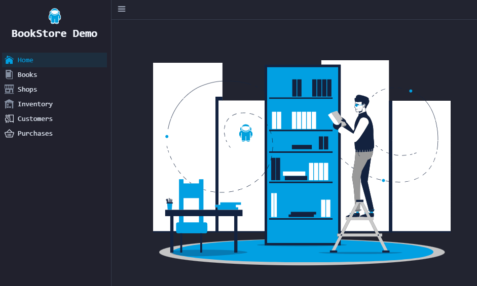

# EclipseStore BookStore Demo

A version of the BookStore Demo which uses the [GigaMap](https://docs.microstream.one/enterprise/gigamap/).

## Running locally

This is a [Spring Boot](https://spring.io/guides/gs/spring-boot/) application built using 
[Maven](https://spring.io/guides/gs/maven/) and [pnpm](https://pnpm.js.org/). 
You can build and run it from the command line:

```
mvn spring-boot:run
```

Then open [http://localhost:8080/](http://localhost:8080/)



## Description

The EclipseStore BookStore Demo is a fully-fledged sample application.
It shows how to design an application with EclipseStore from the ground up.

A company that operates bookstores around the world is modeled.
From the data root on, there are four main domains:

- [Books](./src/main/java/org/eclipse/store/demo/bookstore/data/Books.java): range of all books sold by the company
- [Shops](./src/main/java/org/eclipse/store/demo/bookstore/data/Shops.java): retail shops operated by the company
- [Customers](./src/main/java/org/eclipse/store/demo/bookstore/data/Customers.java): registered customers of the company
- [Purchases](./src/main/java/org/eclipse/store/demo/bookstore/data/Purchases.java): purchases made by all customers in all stores

The [data layer](./src/main/java/org/eclipse/store/demo/bookstore/data/) also contains validation and concurrency handling. 

We used [Vaadin](https://vaadin.com) to create the [UI](./src/main/java/org/eclipse/store/demo/bookstore/ui/).
The start point is the main class [VaadinApplication](./src/main/java/org/eclipse/store/demo/bookstore/VaadinApplication.java).

[GraphQL](./src/main/java/org/eclipse/store/demo/bookstore/graphql/) (mapped to /graphql) is used to get data access from outside. GraphiQL configured to: [http://localhost:8080/graphiql](http://localhost:8080/voyager) 


## If you find a bug or want to suggest an improvement

Please feel free to report issues here: 
[https://github.com/eclipse-store/bookstore-demo/issues](https://github.com/eclipse-store/bookstore-demo/issues)

## License

The EclipseStore BookStore Demo is released under the [Eclipse Public License - v 2.0](LICENSE).


